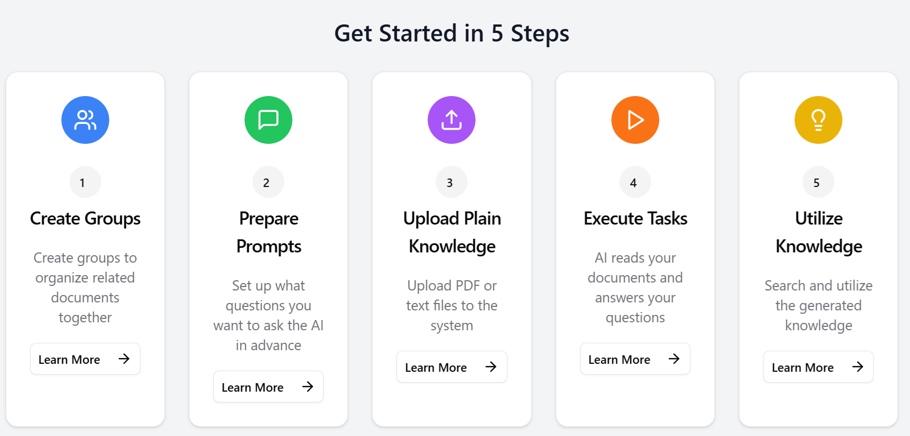
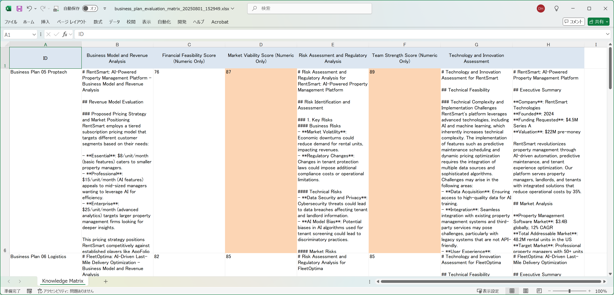

Let's be honest – if you're reading this, you're probably buried under a mountain of business plans right now. Sound familiar?



**The Never-Ending Pile**: Your inbox gets flooded with 50-80 business proposals every quarter. Internal teams pitching their "game-changing" ideas, external partners with "revolutionary" solutions, and startups promising to "disrupt everything." Each one needs a thorough review, and guess who gets to do it?

**The Time Crunch**: Each business plan takes you 4-6 hours to properly evaluate. That's market research, financial deep-dives, team background checks, and risk analysis. Multiply that by dozens of plans, and suddenly you're working weekends again.

**The Inconsistency Problem**: Your colleague Tom scores everything high because he's optimistic. Sarah's a skeptic who finds flaws in everything. Your evaluations are all over the place, making it impossible to compare apples to apples.

**The Documentation Nightmare**: Critical insights scattered across sticky notes, random Excel sheets, and that one email thread from three weeks ago that you can't find anymore.

The result? Those 6-8 week evaluation cycles that make everyone impatient and cost you great opportunities.

## What If There Was a Better Way?

That's where LLMKnowledge3 comes in. Think of it as your AI-powered business plan analysis assistant that never gets tired, never has a bad day, and applies the same rigorous standards to every single proposal.

We decided to put it to the test with 10 realistic business plans to see if it could actually deliver on its promises.

### Our Test: 10 Business Plans from the Real World

We picked a diverse mix that probably looks a lot like your own inbox:

**The AI Startup Everyone's Talking About (ServiceAI Solutions)**
- Wants $2.5M for their customer service automation platform
- Claims they can automate 80% of support tickets (yeah, we've heard that before)
- Team includes a former Zendesk VP and ex-Google AI researcher (okay, that's interesting)
- Market size: $58.1B and growing at 12.2% annually

**The FinTech That Actually Makes Sense (FinanceFlow)**
- Asking for $1.8M to help SMBs with cash flow forecasting
- Target: 28 million small businesses that struggle with this exact problem
- Their secret sauce: 13-week automated forecasting (could be useful)
- Projection: $3.8M revenue by year 3 with positive cash flow

**The HealthTech with FDA Hurdles (HealthSync)**
- Needs $3.2M for remote patient monitoring IoT devices
- Market opportunity: $2.8B and growing fast at 18.6% CAGR
- The catch: 18-month FDA approval timeline (risky but potentially huge)
- Focus: AI early warning systems for chronic diseases

Each plan was packed with the usual suspects – executive summaries, market analysis, financial projections, team bios, and risk assessments. You know the drill.

### How We Set Up the Evaluation (And How You Could Too)

We created six evaluation criteria that mirror what most corporate teams actually care about:

**The Numbers Game (Scored 1-100):**
1. **Market Viability**: How big is the opportunity, really?
2. **Financial Feasibility**: Do the numbers actually add up?
3. **Team Strength**: Can these people actually pull it off?

**The Deep Dive Analysis:**
4. **Business Model Review**: Is this thing actually sustainable?
5. **Technology Assessment**: Is the tech legit or just buzzwords?
6. **Risk Analysis**: What could go wrong and how badly?

Here's what one of our scoring prompts looked like:
```markdown
# Market Viability Score (Numeric Only)

Rate this business plan's market viability from 1-100 based on:
- Market size and growth potential (25 points)
- How clear and reachable their target customers are (20 points)
- Competition and what makes them different (20 points)
- Market timing (20 points)
- Whether their go-to-market plan makes sense (15 points)

Just give me a number between 1-100. That's it.
```

## Setting It Up: Easier Than Your Morning Coffee

Here's what the process actually looked like:

**Step 1: Upload the Plans** (2 minutes)
Drag and drop all 10 business plan files. The system processes them automatically and makes everything searchable.

**Step 2: Set Your Evaluation Criteria** (5 minutes)
Input your standard assessment framework. The beauty is you can customize this to match exactly how your organization evaluates proposals.

**Step 3: Hit the Go Button** (1 minute setup, then you wait)
The AI churns through every combination – 10 plans times 6 criteria equals 60 unique assessments. All happening while you grab another cup of coffee.

## The Results: Finally, Some Clarity



The results were honestly better than we expected. Here's what jumped out:

### Clear Winners and Losers (Finally!)

The scoring system immediately separated the wheat from the chaff:

**Top Performers:**
- AI SaaS Platform: Scored 87 on market viability, 89 on team strength
- HealthTech IoT: Strong across the board with 84, 79, and 85 scores
- Cybersecurity Platform: Balanced performer with consistently high scores

**The Strugglers:**
- A few plans that looked promising on paper scored surprisingly low when analyzed systematically
- Inconsistencies in financial projections were immediately flagged
- Weak team compositions became obvious when scored objectively

### Insights That Would Have Taken You Hours to Find

The detailed analyses were surprisingly thorough. Here's a taste:

**Business Model Reality Check:**
"The recurring revenue model with 85% gross margins looks solid on paper. The customer lifetime value of 28,800 dollars against an acquisition cost of 1,200 dollars is attractive. But here's the thing – their go-to-market strategy relies too heavily on direct sales initially. They'll need to accelerate partner channels to scale effectively..."

**Risk Assessment That Doesn't Miss the Obvious:**
"Main regulatory risks revolve around AI bias and data privacy – especially if they want to expand to EU markets where GDPR compliance could cost $200-400K. Technical risk seems manageable given the team's track record, but customer integration complexity could extend sales cycles significantly..."

### The Time Savings Are Real

Let's do the math:
- **Traditional approach**: 10 plans × 5 hours each = 50 hours of work
- **With LLMKnowledge3**: 30 minutes setup + 5 hours review = 5.5 hours total
- **Time saved**: About 44.5 hours (89% reduction)

That's more than a full work week back in your life.

## What This Could Mean for Your Team

### For You (The Overworked Corporate Dev Manager)
- **Actually go home at a reasonable hour**: Process way more proposals without the all-nighters
- **Consistent standards**: No more wondering if you're being too harsh or too lenient
- **Better documentation**: Everything structured and searchable for when your boss asks questions

### For Your Investment Committee
- **Data-driven discussions**: Compare proposals with actual numbers instead of gut feelings
- **Comprehensive risk view**: Systematic identification of potential problems before they become real problems
- **Faster decisions**: Cut those evaluation cycles from weeks to days

### For Your Innovation Program
- **Handle the volume**: Actually keep up with all those internal innovation proposals
- **Cross-functional insights**: Get technical, financial, and market perspectives all in one place
- **Institutional knowledge**: Stop losing insights when team members leave

## When This Makes Sense (And When It Doesn't)

**Perfect for:**
- Teams evaluating 20+ business plans per quarter
- Organizations needing consistent evaluation standards
- Anyone tired of the manual screening bottleneck

**Maybe not right for:**
- Single, one-off evaluations where human judgment is paramount
- Highly specialized or technical proposals requiring deep domain expertise
- Situations where relationship and personal dynamics are more important than systematic analysis

**Best Used As:**
Your first-pass analysis tool that gives you structured insights to inform your decisions, not replace your judgment entirely.

## The Bottom Line

Look, we've all been there – drowning in business plans, trying to be fair and thorough while the pile just keeps growing. LLMKnowledge3 won't magically make every business plan amazing, but it could make your evaluation process a whole lot more manageable.

The combination of quick quantitative scoring for easy comparisons and detailed qualitative analysis for strategic insights means you get both the overview and the deep dive without sacrificing your weekends.

For corporate teams handling serious proposal volume, this could be the difference between staying afloat and actually getting ahead of the game.

---

**Ready to Test Drive This for Your Own Business Plan Pile?**

LLMKnowledge3 lets you upload your business plans, set up your own evaluation criteria, and generate comprehensive assessment matrices that could actually make your life easier.

*Want to see if it works for your specific use case? Give it a try.*