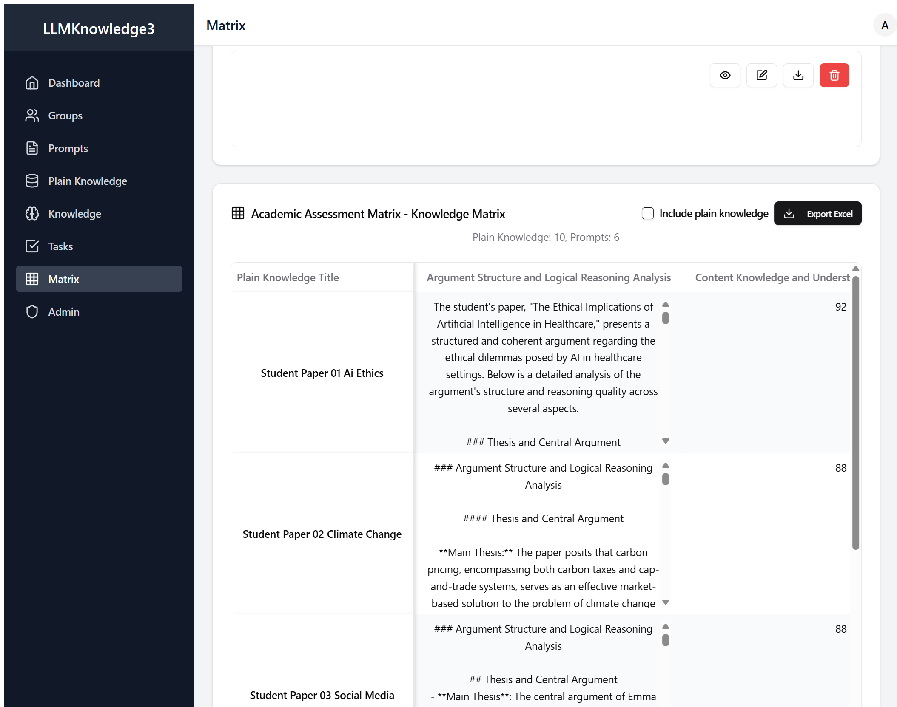
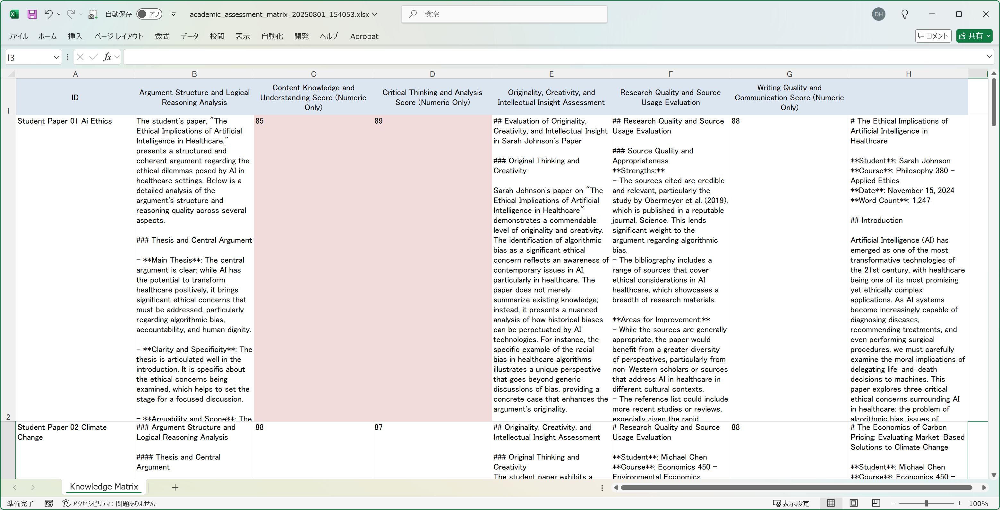

# From Dread to Data: Revolutionizing Grading with LLMKnowledge3

*How AI-Powered Essay Grading Could Transform Your Teaching Life*



---

## The Professor's Nightmare We All Know Too Well

Let's be honest – if you're reading this, you're probably staring at a stack of student papers right now, aren't you? That familiar feeling of dread as deadline season approaches and your desk (or laptop screen) fills up with essays that need thoughtful, detailed feedback.

**The Never-Ending Grading Marathon**: Every semester, you get buried under 80-120 student papers across your courses. Literature analyses, research papers, argumentative essays – each one deserving careful attention and constructive feedback. Each paper takes 15-20 minutes to properly evaluate, and that's if you're being efficient.

**The Consistency Challenge**: By paper 30, you're mentally exhausted. Are you being too harsh on this student compared to the one you graded yesterday morning when you were fresh? Did you remember to check for proper citation format? Your colleague down the hall grades completely differently – some students complain about inconsistent standards between professors.

**The Feedback Dilemma**: Students need meaningful feedback to improve, but writing detailed comments on dozens of papers takes forever. You want to catch plagiarism, assess critical thinking, evaluate argument structure, and provide growth-oriented feedback. It's a huge mental load that keeps you up late and eats into your research time.

**The Documentation Headache**: Keeping track of who struggles with what, which students show improvement, and maintaining consistent rubric application across multiple classes. Plus, try explaining your grading decisions to a student (or their parents) three weeks later.

The result? Those weekend grading sessions that stretch until midnight, leaving you burned out and wondering if there's a better way.

## What If There Was a Smarter Approach?

That's where LLMKnowledge3 comes in. Think of it as your AI teaching assistant that never gets tired, never has a bad day, and applies the same rigorous academic standards to every single student paper. It doesn't replace your professional judgment – it enhances it by handling the heavy lifting of initial assessment.

We decided to test it with 10 diverse student papers to see if it could actually help with the grading workload that's crushing so many of us.

### Our Test: Real Student Papers Across Disciplines

We gathered a realistic mix that probably looks a lot like your own grading pile:

**The Philosophy Major Tackling Big Questions (Sarah Johnson)**
- Course: Applied Ethics  
- Topic: "The Ethical Implications of Artificial Intelligence in Healthcare"
- Length: 1,247 words
- Classic philosophy paper structure with ethical framework analysis and real-world applications

**The Economics Student Wrestling with Policy (Michael Chen)**
- Course: Environmental Economics
- Topic: "The Economics of Carbon Pricing: Market-Based Climate Solutions"
- Length: 1,189 words  
- Data-heavy analysis with theoretical framework and practical case studies

**Plus Papers From Across the Academic Spectrum:**
- Climate change policy analysis (Environmental Science)
- Social media psychology research (Psychology)
- World War I historical analysis (History)
- Cellular biology lab report (Biology)
- Contemporary literature criticism (English)
- Moral philosophy argumentation (Philosophy)
- Sociology field study (Sociology)
- Organic chemistry synthesis (Chemistry)

You know the drill – the usual mix of strong writers, struggling students, and everything in between.

### How We Set Up the Evaluation (And How You Could Too)

We created six evaluation criteria that mirror what most professors actually assess in student writing:

**The Quantitative Measures (Scored 1-100):**
1. **Content Knowledge Score**: How well does the student understand the subject matter?
2. **Critical Thinking Score**: Can they analyze, evaluate, and make connections?
3. **Writing Quality Score**: Is the writing clear, organized, and academically appropriate?

**The Detailed Analysis:**
4. **Research and Sources**: Are they using credible sources effectively?
5. **Argument Structure**: Is their reasoning logical and well-organized?
6. **Originality and Insight**: Do they show independent thinking and creativity?

Here's what one of our scoring prompts looked like:
```markdown
# Critical Thinking and Analysis Score (Numeric Only)

Evaluate the student's critical thinking and analytical skills on a scale of 1-100 considering:
- Quality of argument construction and logical reasoning (30 points)
- Analysis and evaluation of evidence and sources (25 points)  
- Identification and examination of multiple perspectives (20 points)
- Original insights and connections between ideas (15 points)
- Recognition of limitations and counterarguments (10 points)

Just give me a number between 1-100. That's it.
```

## Setting It Up: Simpler Than Setting Up Your LMS

Here's what the process actually looked like:

**Step 1: Upload Student Papers** (3 minutes)
Just drag and drop all the papers into the system. LLMKnowledge3 processes them automatically and makes everything searchable. No need to rename files or worry about formatting.

**Step 2: Configure Your Rubric** (7 minutes)
Input your standard grading criteria. The beauty is you can customize this to match your department's standards, your course learning objectives, or even individual assignment requirements.

**Step 3: Let AI Do the Heavy Lifting** (2 minutes setup, then you wait)
The system analyzes every paper against every criterion – that's 10 papers times 6 evaluation aspects equals 60 detailed assessments. All happening while you finally get to drink your coffee while it's still hot.

## The Results: Finally, Some Teaching Sanity



The results were honestly better than we expected. Here's what jumped out:

### Clear Performance Patterns (At Last!)

The scoring system immediately revealed patterns that would have taken hours to notice:

**Top Performers:**
- Sarah's Philosophy paper: Scored 89 on critical thinking, 85 on content knowledge
- Michael's Economics analysis: Strong across the board with 84, 88, and 82 scores
- The Biology lab report: Excellent content knowledge (91) but weaker on originality (67)

**Students Needing Support:**
- Several papers showed strong writing quality but weak critical thinking scores
- Some students had great ideas but struggled with proper source integration
- A few demonstrated good content knowledge but poor argument structure

### Insights That Would Have Taken You Hours to Develop

The detailed analyses were surprisingly thorough and pedagogically useful:

**Critical Thinking Assessment Example:**
"The student demonstrates solid understanding of ethical frameworks but struggles to apply them consistently to the healthcare AI scenarios presented. The analysis of algorithmic bias is particularly strong, showing genuine engagement with contemporary issues. However, the discussion of accountability frameworks lacks depth and misses key perspectives from medical ethics literature. Recommend encouraging the student to explore counterarguments more thoroughly."

**Research Quality Feedback:**
"Strong use of peer-reviewed sources with appropriate academic credibility. The integration of the Obermeyer et al. study effectively supports the bias argument. However, the paper would benefit from more recent sources – several citations are from 2019-2020 when more current research is available. Citation format is generally correct but inconsistent in a few instances."

### The Time Savings Are Game-Changing

Let's do the math that every professor knows by heart:
- **Traditional grading**: 10 papers × 18 minutes each = 3 hours of focused grading time
- **With LLMKnowledge3**: 12 minutes setup + 45 minutes review and adjustment = 57 minutes total
- **Time saved**: About 2 hours per batch (68% reduction)

That's enough time to actually eat lunch, prep for your next class, or (revolutionary idea) leave the office at a reasonable hour.

## What This Could Mean for Your Academic Life

### For You (The Overworked Professor)
- **Reclaim your weekends**: Grade more efficiently without sacrificing feedback quality
- **Consistent standards**: No more wondering if you're being fair across all students
- **Better documentation**: Everything structured and trackable for grade justification and student conferences

### For Your Students
- **Faster feedback**: Quicker turnaround times mean more opportunities for revision and improvement
- **More detailed insights**: Comprehensive analysis across multiple dimensions of their work
- **Consistent evaluation**: Fair assessment regardless of when their paper gets graded in your pile

### For Your Department
- **Standardized assessment**: More consistent evaluation across different professors and sections
- **Data-driven insights**: Track student writing development over time and across courses
- **Reduced grading burnout**: Faculty can focus more energy on teaching and research

## When This Makes Sense (And When It Doesn't)

**Perfect for:**
- Large lecture courses with substantial writing assignments
- Professors teaching multiple sections of composition or general education courses
- Departments wanting to standardize assessment practices
- Anyone drowning in papers and losing sleep over grading backlogs

**Maybe not ideal for:**
- Highly specialized graduate seminars where disciplinary expertise is paramount
- Creative writing courses where subjective aesthetic judgment is central
- Small classes where you know every student personally and can provide completely individualized feedback

**Best Used As:**
Your intelligent first-pass grading assistant that provides structured insights to inform your final evaluation, not replace your professional judgment entirely.

## The Reality Check

Look, we've all been there – that Sunday night panic when you realize you have 40 papers to grade before Monday's class, or the guilt when a student asks about feedback and their essay has been sitting in your pile for two weeks.

LLMKnowledge3 won't magically make every student paper brilliant, but it could make your grading process a whole lot more manageable and consistent. The combination of quick quantitative scores for easy comparison and detailed qualitative analysis for meaningful feedback means you get both the overview and the depth without sacrificing your sanity.

For professors handling serious paper loads – whether you're teaching composition, managing large lecture courses, or juggling multiple sections – this could be the difference between burning out and actually enjoying teaching again.

The best part? Your students get better, more consistent feedback, and you get your life back. It's not about lowering standards – it's about applying them more efficiently and effectively.

---

**Ready to Test Drive This for Your Own Grading Pile?**

LLMKnowledge3 lets you upload student papers, configure your own evaluation criteria, and generate comprehensive assessment matrices that could actually give you back those lost evenings and weekends.

*Want to see if it works for your specific courses and student population? Give it a try.*