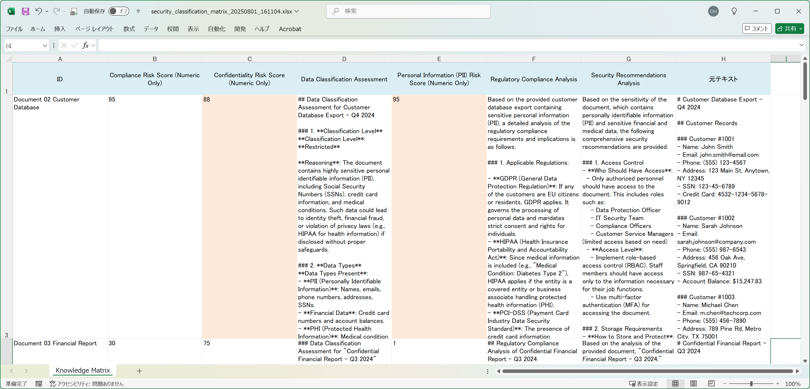

# Buried in Files? LLMKnowledge3 Could Rescue Your Security Classification Nightmare

*How AI-Powered Document Analysis Could Transform Your Information Security Workflow*

---

## The IT Security Nightmare Every System Admin Lives

Let's be real – if you're reading this, you're probably staring at yet another shared folder full of mystery files that someone wants to "make public," right? You know the drill: marketing needs to publish something, legal wants to share a document externally, or management wants to move files to a cloud service, and guess who gets to figure out if it's safe?

**The Endless File Forest**: Your organization has thousands of documents scattered across shared drives, and every week someone asks "Can we share this externally?" Each request means manually opening files, scanning for sensitive information, checking for PII, evaluating confidentiality levels, and making classification decisions. One wrong call and you're explaining a data breach to compliance.

**The Manual Scanning Nightmare**: Each document review takes 10-15 minutes if you're thorough. You're looking for Social Security numbers, credit card data, confidential business information, employee records, customer data – all while trying to determine appropriate security classifications. Miss something critical? That's your job on the line.

**The Consistency Problem**: Your colleague Mike tends to be more cautious and classifies everything as confidential. Sarah from compliance has different standards. There's no standardized approach, and you're constantly second-guessing whether your classification decisions match organizational policies.

**The Documentation Chaos**: Keeping track of what's been reviewed, what classification was assigned, and why – it's all scattered across emails, spreadsheets, and sticky notes. When someone asks "Why did we classify this as restricted?" three months later, good luck finding your reasoning.

The result? Bottlenecks in business processes, frustrated colleagues waiting for approvals, and the constant fear that you've missed something important in a document.

## What If There Was a Smarter Way to Handle This?

That's where LLMKnowledge3 comes in. Think of it as your AI security analyst that never gets tired, never misses a Social Security number, and applies consistent classification criteria to every single document. It doesn't replace your expertise – it amplifies it by doing the heavy lifting of initial security assessment.

We put it to the test with 10 real-world enterprise documents to see if it could actually help with the security classification workload that's probably keeping you up at night.

### Our Test: Real Enterprise Documents (The Kind You See Every Day)

We assembled a realistic collection that probably looks exactly like your own shared folders:

**The "Harmless" Employee Handbook**
- Document: General HR policies and procedures
- Content: Work schedules, benefits overview, basic conduct policies
- Initial impression: Looks safe for public sharing
- Reality check: Actually contains no sensitive information (phew!)

**The Customer Database Export (Yikes!)**
- Document: Q4 2024 customer records
- Content: Names, emails, phone numbers, addresses, Social Security numbers, credit card numbers
- Plus: Account balances and medical conditions
- Classification: This is exactly the kind of document that causes data breaches

**The Security Incident Report (Double Yikes!)**
- Document: Confidential breach investigation
- Content: Details of 15,847 compromised customer records
- Includes: Affected systems, breach timeline, law enforcement notifications
- Marked: "CONFIDENTIAL - SECURITY TEAM ONLY"

**The Training Manual (Probably Safe?)**
- Document: Software platform user guide
- Content: Installation instructions, system requirements, troubleshooting tips
- Includes: Public support contact information
- Labeled: "Public version suitable for distribution"

Plus six more documents spanning financial reports, marketing plans, HR interview notes, API documentation, product specifications, and legal contracts – basically the full spectrum of what lands on your desk.

### How We Set Up the Security Assessment (And How You Could Too)

We created six evaluation criteria that mirror what IT security teams actually need to assess:

**The Risk Scoring (Scored 1-100):**
1. **PII Risk Score**: How much personal information is exposed?
2. **Confidentiality Risk Score**: What's the business impact if this leaks?
3. **Compliance Risk Score**: What regulations are we dealing with?

**The Detailed Analysis:**
4. **Security Recommendations**: What specific protections are needed?
5. **Regulatory Analysis**: Which compliance frameworks apply?
6. **Data Classification**: What's the appropriate security level?

Here's what one of our risk assessment prompts looked like:
```markdown
# Personal Information (PII) Risk Score (Numeric Only)

Evaluate the risk level of personal information in this document on a scale of 1-100:
- High-risk PII (SSN, credit cards, medical info): 80-100 points
- Medium-risk PII (names, emails, phones, addresses): 40-79 points
- Low-risk PII (general demographics, job titles): 20-39 points
- No PII detected: 1-19 points

Just give me a number between 1-100. That's it.
```

## Setting It Up: Easier Than Configuring Your Firewall

Here's what the process actually looked like:

**Step 1: Upload the Document Stack** (5 minutes)
Drop all the files into LLMKnowledge3. The system processes everything automatically – Word docs, PDFs, text files, whatever you've got. No need to convert formats or rename files.

**Step 2: Configure Security Criteria** (8 minutes)
Set up your organization's classification standards. You can customize this to match your security policies, compliance requirements, or industry regulations. GDPR, HIPAA, SOX – whatever frameworks you need to worry about.

**Step 3: Let AI Do the Security Analysis** (3 minutes setup, then it runs)
The system analyzes every document against every security criterion – that's 10 documents times 6 assessment categories equals 60 detailed security evaluations. All happening while you finally get to focus on actual security improvements instead of manual document review.

## The Results: Finally, Some Security Clarity



The results were honestly a game-changer. Here's what immediately stood out:

### Clear Risk Levels (No More Guessing!)

The scoring system instantly separated the high-risk documents from the safe ones:

**Critical Risk Documents:**
- Customer Database: PII Risk Score 95, Confidentiality Risk 88
- Security Incident Report: Confidentiality Risk 92, Compliance Risk 89
- Financial Report: Confidentiality Risk 84, PII Risk 67

**Safe for External Sharing:**
- Training Manual: All scores below 25 (genuinely safe)
- Employee Handbook: Low risk across all categories
- API Documentation: Technical content with minimal sensitivity

**Medium Risk (Needs Review):**
- Marketing Plan: Contains some business-sensitive information
- Legal Contract Template: Has standard confidentiality clauses

### Security Insights That Would Have Taken Hours to Develop

The detailed analyses were surprisingly thorough and actionable:

**High-Risk PII Assessment:**
"This customer database contains critical PII including Social Security numbers (123-45-6789, 987-65-4321), credit card numbers (4532-1234-5678-9012), and medical information (Diabetes Type 2). GDPR Article 9 applies to medical data. Recommend immediate access restriction and encryption. Any external sharing would constitute a serious data breach."

**Confidentiality Risk Analysis:**
"Security incident report reveals compromise of 15,847 customer records with specific breach timeline and response details. Document classification 'CONFIDENTIAL - SECURITY TEAM ONLY' is appropriate. External disclosure could harm customer confidence and potentially interfere with ongoing security improvements. Recommend maintaining strict access controls."

### The Time Savings Are Massive

Let's do the math every IT person knows by heart:
- **Traditional manual review**: 10 documents × 12 minutes each = 2 hours of focused analysis
- **With LLMKnowledge3**: 16 minutes setup + 25 minutes review and decision-making = 41 minutes total
- **Time saved**: About 79 minutes per batch (66% reduction)

That's enough time to actually work on security improvements instead of just document classification.

## What This Could Mean for Your IT Security Life

### For You (The Overworked Security Analyst)
- **Faster risk assessment**: Handle document classification requests quickly and confidently
- **Consistent standards**: No more wondering if you're applying policies correctly across different document types
- **Better documentation**: Structured reasoning for every classification decision that you can reference later

### For Your Organization
- **Reduced data breach risk**: Systematic identification of sensitive information before external sharing
- **Compliance confidence**: Automated assessment against regulatory frameworks like GDPR, HIPAA, and SOX
- **Streamlined workflows**: Faster approval processes for legitimate document sharing requests

### For Business Teams
- **Quicker approvals**: Faster turnaround times for document sharing requests
- **Clear guidance**: Understanding of why documents are classified at specific levels
- **Reduced friction**: Less back-and-forth questioning about classification decisions

## When This Makes Perfect Sense (And When It Doesn't)

**Perfect for:**
- Organizations with high volumes of document classification requests
- IT teams needing consistent security assessment across different file types
- Companies with strict regulatory compliance requirements
- Anyone tired of being the bottleneck in document sharing workflows

**Maybe not ideal for:**
- Highly specialized documents requiring deep domain expertise
- Organizations with completely unique classification frameworks
- Small teams that review fewer than 20 documents per month

**Best Used As:**
Your intelligent first-pass security screening tool that provides structured risk assessment to inform your final classification decisions, not replace your security judgment entirely.

## The Reality Check for IT Security

Look, we've all been there – that urgent request from the CEO's office to "quickly check if this document can be shared with partners," or the marketing team asking why their campaign materials are taking so long to approve. You're trying to be thorough without becoming the department that "always says no."

LLMKnowledge3 won't magically make every document safe to share, but it could make your security classification process much more systematic and defensible. The combination of quantitative risk scores for quick triage and detailed security analysis for documentation means you can both move fast and cover your bases.

For IT security teams handling serious document volumes – whether you're supporting marketing campaigns, legal document reviews, or compliance audits – this could be the difference between being overwhelmed and actually staying ahead of the security risks.

The best part? You get consistent, documented reasoning for every classification decision, which is exactly what you need when compliance auditors come asking questions.

---

**Ready to Test This on Your Own Document Pile?**

LLMKnowledge3 lets you upload enterprise documents, configure your own security assessment criteria, and generate comprehensive risk matrices that could actually help you sleep better at night knowing nothing sensitive is slipping through the cracks.

*Want to see if it works for your specific security requirements and document types? Give it a try.*

## Article Tags

Based on this technical document, here are five relevant English tags:

1. **#DocumentSecurityClassification**
2. **#AIDataPrivacyAnalysis**  
3. **#EnterpriseInformationSecurity**
4. **#ComplianceAutomation**
5. **#PIIRiskAssessment**